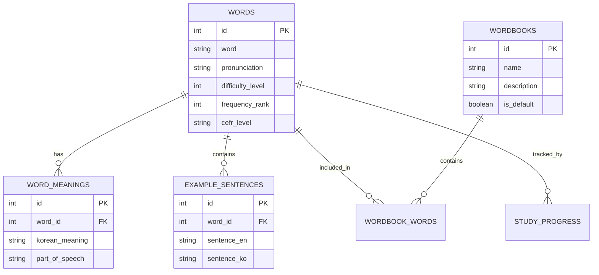

# 🗃️ Scan_Voca Database Structure

## 📊 Database Overview

- **Total Words**: 153,256
- **Database Size**: ~58MB  
- **Tables**: 9
- **Primary Table**: `words` (main vocabulary data)

---

## 🗂️ Core Tables

### 1. `words` (Primary Table)
**📝 Main vocabulary storage with 153,256 records**

| Column | Type | Description | Key |
|--------|------|-------------|-----|
| `id` | INTEGER | Unique identifier | 🔑 PK |
| `word` | TEXT | English word | ✅ Required |
| `pronunciation` | TEXT | IPA pronunciation | 📢 Optional |
| `difficulty_level` | INTEGER | 1-5 difficulty rating | ⭐ Default: 1 |
| `frequency_rank` | INTEGER | Usage frequency rank | 📊 Optional |
| `created_at` | DATETIME | Creation timestamp | 🕐 Auto |
| `updated_at` | DATETIME | Last update timestamp | 🔄 Auto |
| `cefr_level` | TEXT | A1-C2 CEFR rating | 🎓 Optional |

#### 📈 Difficulty Distribution
```
Level 1 (10.0%): ████████████████████ 15,325 words
Level 2 (25.0%): ██████████████████████████████████████████████████ 38,314 words  
Level 3 (35.0%): ██████████████████████████████████████████████████████████████████████ 53,639 words
Level 4 (25.0%): ██████████████████████████████████████████████████ 38,314 words
Level 5 (5.0%):  ██████████ 7,664 words
```

#### 🌍 CEFR Level Distribution
| CEFR Level | Count | Description |
|------------|-------|-------------|
| A1 | 62 | Beginner |
| A2 | 95 | Elementary |
| B1 | 81 | Intermediate |
| B2 | 93 | Upper-Intermediate |

#### 📏 Word Length Analysis
```
Length Distribution (Most Common):
9 chars: ████████████████████████████ 19,911 words
8 chars: ████████████████████████████ 19,140 words
10 chars: ██████████████████████████ 18,223 words
7 chars: ████████████████████████ 15,989 words
11 chars: ████████████████████ 14,651 words
```

---

### 2. `word_meanings` 
**📚 Korean translations (235,437 records)**

| Column | Type | Description |
|--------|------|-------------|
| `id` | INTEGER | Primary key |
| `word_id` | INTEGER | Links to words table |
| `korean_meaning` | TEXT | Korean translation |
| `part_of_speech` | TEXT | n., v., adj., etc. |
| `definition_en` | TEXT | English definition |
| `source` | TEXT | Dictionary source |

---

### 3. `example_sentences`
**💬 Example usage (14,446 records)**

| Column | Type | Description |
|--------|------|-------------|
| `id` | INTEGER | Primary key |
| `word_id` | INTEGER | Links to words table |
| `sentence_en` | TEXT | English example |
| `sentence_ko` | TEXT | Korean translation |
| `difficulty_level` | INTEGER | Sentence difficulty |

---

### 4. `wordbooks`
**📖 User word collections (3 records)**

| Column | Type | Description |
|--------|------|-------------|
| `id` | INTEGER | Primary key |
| `name` | TEXT | Wordbook name |
| `description` | TEXT | Description |
| `is_default` | BOOLEAN | Default wordbook flag |

---

### 5. `wordbook_words`
**🔗 Word-to-wordbook mapping (0 records)**

| Column | Type | Description |
|--------|------|-------------|
| `id` | INTEGER | Primary key |
| `wordbook_id` | INTEGER | Links to wordbooks |
| `word_id` | INTEGER | Links to words |
| `added_at` | DATETIME | When added |

---

### 6. `study_progress`
**📊 Learning analytics (0 records)**

| Column | Type | Description |
|--------|------|-------------|
| `id` | INTEGER | Primary key |
| `word_id` | INTEGER | Links to words |
| `correct_count` | INTEGER | Times answered correctly |
| `incorrect_count` | INTEGER | Times answered incorrectly |
| `last_studied` | DATETIME | Last study session |
| `next_review` | DATETIME | Spaced repetition schedule |

---

## 🔗 Database Relationships



---

## 📋 Sample Data

| Word | Difficulty | CEFR | Type |
|------|------------|------|------|
| the | 1 | A1 | Basic article |
| promenade | 2 | - | Compound word |
| threescore | 3 | - | Archaic term |
| minimum purchase | 4 | - | Business phrase |
| supercarbureted | 5 | - | Technical term |

---

## 🚀 Usage Examples

### Get words by difficulty
```sql
SELECT word, pronunciation, cefr_level
FROM words
WHERE difficulty_level = 1
ORDER BY frequency_rank
LIMIT 20;
```

### Get random quiz words
```sql
SELECT w.word, wm.korean_meaning
FROM words w
JOIN word_meanings wm ON w.id = wm.word_id
WHERE w.difficulty_level BETWEEN 2 AND 4
ORDER BY RANDOM()
LIMIT 10;
```

### Find words with examples
```sql
SELECT w.word, es.sentence_en, es.sentence_ko
FROM words w
JOIN example_sentences es ON w.id = es.word_id
WHERE w.difficulty_level = 3
LIMIT 5;
```

### Difficulty statistics
```sql
SELECT 
    difficulty_level,
    COUNT(*) as count,
    ROUND(COUNT(*) * 100.0 / (SELECT COUNT(*) FROM words), 1) as percentage
FROM words
GROUP BY difficulty_level
ORDER BY difficulty_level;
```

---

## 🎯 Key Features

- ✅ **Comprehensive**: 153K+ words with meanings and examples
- ⭐ **Difficulty System**: 5-level classification (1=easy → 5=expert)
- 🌍 **CEFR Compatible**: European language standard integration
- 📊 **Analytics Ready**: Study progress and performance tracking
- 🔄 **Spaced Repetition**: Built-in review scheduling
- 📱 **App-Ready**: Optimized for mobile vocabulary learning

---

*Generated on 2025-09-15 | Database Version: vocabulary.db (58MB)*